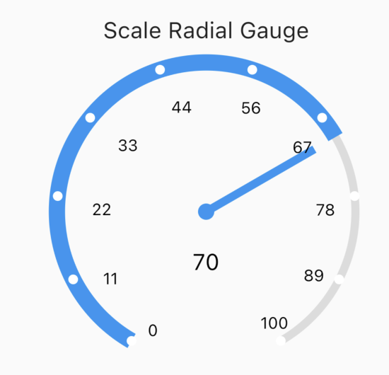
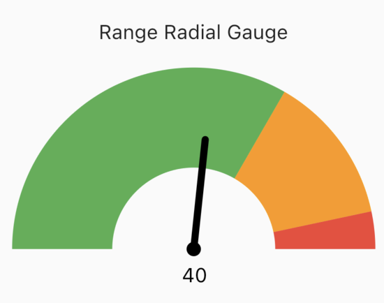
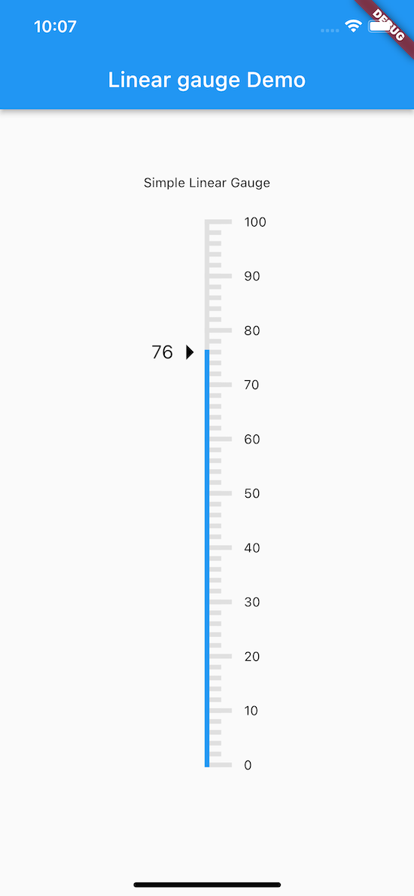

<!---
Adding the atPlatform logos gives a nice look for your readme
-->


<!---
Add a badge bar for your package by replacing at_radial_gauges below with
your package name below and at_radial_gauges with the name of the repo
-->
[](https://pub.dev/packages/at_gauges) [](https://pub.dev/packages/at_gauges/score) [](https://github.com/atsign-foundation/at_gauges/actions/workflows/at_gauges.yaml) [](./LICENSE)

<!--- this is a table version
| [](https://pub.dev/packages/at_radial_gauges) | [](https://pub.dev/packages/at_radial_gauges/score) | [](https://github.com/atsign-foundation/at_radial_gauges/actions/workflows/at_radial_gauges.yaml) | [](./LICENSE) |
| ---------------------------------------------------------------------------------------------------------- | ------------------------------------------------------------------------------------------------------------------ | -------------------------------------------------------------------------------------------------------------------------------------------------------------------------------------------------------------------------------------- | ---------------------------------------------------------------------------------- ||
-->
## Overview
<!---
## Who is this for?
The README should be addressed to somebody who's never seen this before.
But also don't assume that they're a novice.
-->
The at_gauges package is for Flutter developers who want to build beautiful and customizable gauges.

<!---
Give some context and state the intent - we welcome contributions - we want
pull requests and to hear about issues. Include the boilerplate language
below to add some context to @‎platform packages 
-->
This open source package is written in Dart, supports Flutter  with the following widgets: 
  
##### SimpleRadialGauge
  

##### ScaleRadialGauge
  
  
##### SimpleLinearGauge
  
<!-- - Range radial gauge -->
  <!--- add package features here -->

We welcome suggestions you may have to create more gauges or to add features to gauges already created. 

<!---
Does this package publish to pub.dev or similar? This README will be the
first thing that developers see there and should be written such that it
lets them quickly assess if it fits their need.
-->
## Get started
There are two options to get started using this package.

<!---
If the package has a template that at_app uses to generate a skeleton app,
that is the quickest way for a developer to assess it and get going with
their app.
-->
<!-- ### 1. Quick start - generate a skeleton app with at_app
This package includes a working sample application in the
[Example](./example) directory that you can use to create a personalized
copy using ```at_app create``` in four commands.

```sh
$ flutter pub global activate at_app 
$ at_app create --sample=<package ID> <app name> 
$ cd <app name>
$ flutter run
```
Notes: 
1. You only need to run ```flutter pub global activate``` once
2. Use ```at_app.bat``` for Windows -->


<!---
Cloning the repo and example app from GitHub is the next option for a
developer to get started.
-->
### 1. Clone it from GitHub
<!---
Make sure to edit the link below to refer to your package repo.
-->
Feel free to fork a copy of the source from the [GitHub repo](https://github.com/atsign-foundation/at_gauges).

```sh
$ git clone https://github.com/atsign-foundation/at_gauges
```

<!---
The last option is to use the traditionaL instructions for adding the package to a project which can be found on pub.dev. 
Please be sure to replace the package name in the url below the right one for this package.
-->
### 2. Manually add the package to a project

Instructions on how to manually add this package to you project can be found on pub.dev [here](https://pub.dev/packages/at_gauges/install).

<!---
Include an explanation on how to setup and use the package
-->
## How it works

<!---
Add details on how to setup the package
-->
### Setup
This package need to be imported like this;
```dart
import 'package:at_gauges/at_gauges.dart';
```
<!---
Add details on how to use the package in an application
-->
### Usage

<!---
Make sure your source code annotations are clear and comprehensive.
-->

This package provides three beautiful gauges;

#### Simple Radial Gauge Example

The code snippet below shows the simple gauge widget with the required  `actualValue`, `maxValue` and the optional properties. 

```dart
SimpleRadialGauge(
    actualValue: 50,
    maxValue: 100,
    // Optional Parameters
    minValue: 0,
    title: Text('Simple Radial Gauge'),
    titlePosition: TitlePosition.top,
    unit: 'L',
    icon: Icon(Icons.water),
    pointerColor: Colors.blue,
    decimalPlaces: 0,
    isAnimate: true,
    animationDuration: 2000,
    size: 400,
),
```

#### Scale Radial Gauge

The code snippet below shows the scale gauge widget with the required  `actualValue`, `maxValue` and the optional properties.
```dart
ScaleRadialGauge(
    maxValue: 100,
    actualValue: 70,
    // Optional Parameters
    minValue: 0,
    size: 400,
    title: Text('Scale Radial Gauge'),
    titlePosition: TitlePosition.top,
    pointerColor: Colors.blue,
    needleColor: Colors.blue,
    decimalPlaces: 0,
    isAnimate: true,
    animationDuration: 2000,
    unit: TextSpan(text: 'Km/h', style: TextStyle(fontSize: 10)),
)
```



<!-- #### Range Radial Gauge
The code snippet below shows the range gauge widget with the required  `actualValue`, `maxValue` and `range` properties. The  `maxDegree`, `startDegree`, `isLegend`, `title` and `titlePosition` properties are optional.

```dart
RangeRadialGauge(
    maxValue: 75,
    actualValue: 40,
    maxDegree: 180,
    startDegree: 180,
    title: const Text('Range Radial Gauge'),
    titlePosition: TitlePosition.top,
    ranges: [
        Range(
        label: 'slow',
        lowerLimit: 0,
        upperLimit: 50,
        backgroundColor: Colors.green,
        ),
        Range(
        label: 'medium',
        lowerLimit: 50,
        upperLimit: 70,
        backgroundColor: Colors.orange,
        ),
        Range(
        label: 'fast',
        lowerLimit: 70,
        upperLimit: 75,
        backgroundColor: Colors.red,
        ),
    ],
),
```
 -->

#### Simple Linear Gauge

The code snippet below shows the simple gauge widget with the required  `actualValue`, `maxValue` and the optional` properties.

```dart
SimpleLinearGauge(
    maxValue: 100,
    actualValue: 76,
    //Optional Parameters
    minValue: 0,
    divisions: 10,
    title: const Text('Simple Linear Gauge'),
    titlePosition: TitlePosition.top,
    pointerColor: Colors.blue,
    pointerIcon: const Icon(Icons.arrow_right, size: 40),
    decimalPlaces: 0,
    isAnimate: true,
    animationDuration: 2000,
    gaugeStrokeWidth: 5,
    rangeStrokeWidth: 5,
    majorTickStrokeWidth: 5,
    minorTickStrokeWidth: 5,
    actualValueTextStyle: const TextStyle(color: Colors.black, fontSize: 20),
    majorTickValueTextStyle: const TextStyle(color: Colors.black),
),
```


For more information, please see the example tab or API documentation listed on pub.dev. 


<!---
If we have any pages for these docs on atsign.dev site, it would be 
good to add links.(optional)
-->

<!---
You should include language like below if you would like others to contribute
to your package.
-->
## Open source usage and contributions
This is  open source code, so feel free to use it as is, suggest changes or 
enhancements or create your own version. See [CONTRIBUTING.md](CONTRIBUTING.md) 
for detailed guidance on how to setup tools, tests and make a pull request.

<!---
Have we correctly acknowledged the work of others (and their Trademarks etc.)
where appropriate (per the conditions of their LICENSE?
-->
<!-- 
## Acknowledgement/attribution 
-->

<!---
Who created this?  
Do they have complete GitHub profiles?  
How can they be contacted?  
Who is going to respond to pull requests?  
-->
## Maintainers
[Curtly Critchlow](https://github.com/CurtlyCritchlow)
<!---
## Checklist

- [ ] Writing and style
Does the writing flow, with proper grammar and correct spelling?

- [ ] SEO
Always keep in mind that developers will often use search to find solutions
to their needs. Make sure and add in terms that will help get this package to
the top of the search results for google, pub.dev and medium.com as a minimum.

- [ ] Links
Are the links to external resources correct?
Are the links to other parts of the project correct
(beware stuff carried over from previous repos where the
project might have lived during earlier development)?

- [ ] LICENSE
Which LICENSE are we using?  
Is the LICENSE(.md) file present?  
Does it have the correct dates, legal entities etc.?
-->